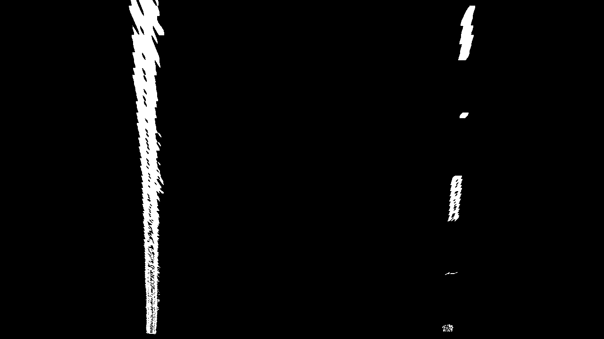

### Advanced Lane Finding Project

The main goal of the project is detect lanes on an image, find radius of curvature of the road and offset of center of car.

The steps below is a processing pipeline to detect the lanes and make the measurements

* Compute the camera calibration matrix and distortion coefficients given a set of chessboard images.
* Apply a distortion correction to raw images.
* Use color transforms, gradients, etc., to create a thresholded binary image.
* Apply a perspective transform to rectify binary image ("birds-eye view").
* Detect lane pixels and fit to find the lane boundary.
* Determine the curvature of the lane and vehicle position with respect to center.
* Warp the detected lane boundaries back onto the original image.
* Overlay the lanes and measurements on the original image

** Processing Pipeline


** Code Organization 

| File                                | Description                                                                        |
| ----------------------------------- | ---------------------------------------------------------------------------------- |
|`/Code/MainCode.ipynb`      | Code demonstrating steps of complete image processing pipeline |
|`/Code/Undistorter.py`      | Class for camera calibration based on the set of calibration images. |
|`/Code/Thresholder.py`     | Class for Color and Gradient Thresholding of image|
|`/Code/PerspectiveTransformer.py`   | Class for performing perspective transformation and it's inverse|
|`/Code/LaneDetector.py` | Class of detected lanes and fitting curve, also includes measurement routines |
|`/Code/LanePlotter.py`        | Class for Plotting Lanes and Measurements onto image |
|`/Code/LaneTracker.py`      | Class inclusive of all image processing pipeline steps |

### Procesing Pipeline ###

### Step 1: Camera Calibration ###
Why do we need to perform camera calibration?
A good tutorial explaining these effects can be found at: http://aishack.in/tutorials/major-physical-defects-cameras/

Cameras and lenses have distortion due to manufacturing. Theoritically a parabolic lens has the best performance, however it is hard to manufacture a parabolic lens. Most of the lens manufactured are spherical lens and this introduces two types of distortion: a) Radial Distoprtion b) Tangential Distortion

* Radial distortion: 
Radial Distortion is caused due to the spherical shape of lens. This is because light travelling through center of lens doesn't get bent due to refraction. However, light passing through edges go through bending and thus the image at the periphery gets distorted. This type of distortion at the edges is described as "Radial Distortion"

* Tangential Distortion:
When the lens is not placed parallel to the imaging plane (the CCD sensor, etc) a tangential distortion is produced.


The code for the unistorting is found in undistorter.py.

** Algorithm:**

* Find the corners in uncalibrated images (image points)
* Create a list of object points i.e., where the points are in real-world(object points)
* Use opencv calibrateCamera to get calibration matrix etc.,
* Use the calibration matrix etc., to undistort a new image opencv's undistort function

** Example Output **

| Before Calibration |After Calibration|
|---|---|
|  |  |


### Step 2: Thresholding to detect edges###

Gradients are typically used to detect edges (or lines in this case). There are multiple gradient operators in computer vision, we will be using Sobel operator. Sobel operator highlights rapid changes in intensity. We will be using a simple sobel kernel and convolve with image to perform gradient operation.
Also, to improve localizing the lanes we will be using our problem specific color thresholding. For color we simply convert the frame to HLS color space and apply a threshold on the S channel. The reason we use HLS here is because it proved to perform best in separating light pixels (road markings) from dark pixels (road) using the saturation channel.

** Algorithm: **

One of the problems I had with gradient thresholding is that the hood of the car was appearing in some of the images and was causing problem. To overcome this problem, I used color thresholding.
Reference: https://medium.com/@MSqalli/advanced-lane-detection-6a769de0d581#.qhd7zefyo

** Example Output **

| Before Thresholding (road image)|After Thresholding|
|---|---|
|  |  |

### Step 3: Correct Perspective Error ###

As we can see in the road image aove, the yellow lane and white lane appear to be converging while in reality we know that the lanes are parallel. This happens because of perpsective error. The perspective error on the images have to be corrected before we make measurement on the road curvature. We can notice in the images below that after the perspective correction, the lanes appear to be parallel as we expect.

** Algorithm: **
1. Collect four points on the image manually to transform using lanes or checkerboard
2. Use opencv's perspective transform to "cv2.getPerspectiveTransform" to compute the perspective transformation matrix
3. Also, get inverse perspective tranform matrix to map the detected lanes on perspective corrected image to original image

I have used the source and destination points provided by udacity. Below are the source and destination points I have used to convert trapezoid to rectangle:

| Source | Destination |
| ------ | ----------- |
| `(585, 460)` | `(320, 0)` |
| `(203, 720)` | `(320, 720)` |
| `(1127, 720)` | `(960, 720)` |
| `(695, 460)` | `(960, 0)` |

Code for this can be found at PerspectiveTransformer.py

** Example Output: **

| Before perspective correction (thresholded image)|After Perspective correction (thresholded image)|
|---|---|
|  |  |

### Step 4: Detect Lanes using Sliding Window approach ###
I have used the sliding window approach to identify and fit curve to the lane

** Algorithm: **

1. Take a histogram of the bottom half of the image. The two peaks inside the histogram will act as starting point for left lane and right lane (peak in first half of histogram left lane and other half peak is right lane)
2. Then divide the image into N equal windows or boxes. In each window, find and collect non-zero indices from the center of the previous box + margin. The center/mean of the non-zero indices in current box will also act as starting search point for next window. Left lane and right lane non-zero indices for each window are collected seperately
3. Once the non-zero point locations in each window (with in the search margin) are collected, a second order polynomial is fit for the data points to identify a global curve (lane) which fits the data.

Code for this can be found in LaneDetector.py

** Curve fit result **


### Step 5: Project the curve fitted lines to original image ###

Once the curve-fitted lanes are found, they are projected back into original image. 

** Alogirthm **
1. For this we use inverse perspective transformation matrix  discussed in Step 3. We use opencv warpPerspective function with inverse transformation matrix. For example, this would convert rectangle to trapezoid.
2. Overlay the curve fit lines using opencv's add weighted function

Code for this can be found in LanePlotter.py

** Detected lane on original image **


### Step 6: Find radius of curvature and offset from center ###

Earlier, we located the lane line pixels, used their x and y pixel positions to fit a second order polynomial curve:


a) Radius of Curvature:
f(y)=A*(y**2)+B*y+C

We were fitting for f(y), rather than f(x), because the lane lines in the warped image are near vertical and may have the same x value for more than one y value.

Radius of curvature can be calculated as:
Rcurve = ((1+(2Ay+B)^2)^1.5)/abs(2A)
The y values of your image increase from top to bottom, so if, for example, you wanted to measure the radius of curvature closest to your vehicle, you could evaluate the formula above at the y value corresponding to the bottom of your image, or in Python, at yvalue = image.shape[0].

b) Position Offset:
This can be calculated as the distance between (left lane position + right lane psoition)/2 at bottom of the image - image point mid point at bottom of the image

Code for this and position offset can be found inside process function of LaneTracker.py

** Result: **


## Final Video ##

The total pipeline code is at /Code/MainCode.ipynb
The final video of the pipeline implementation can be watched here:

https://youtu.be/BMUABwRbmZE


```python

```
